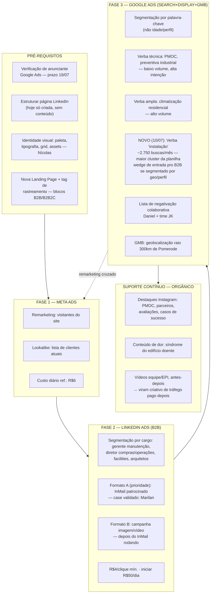
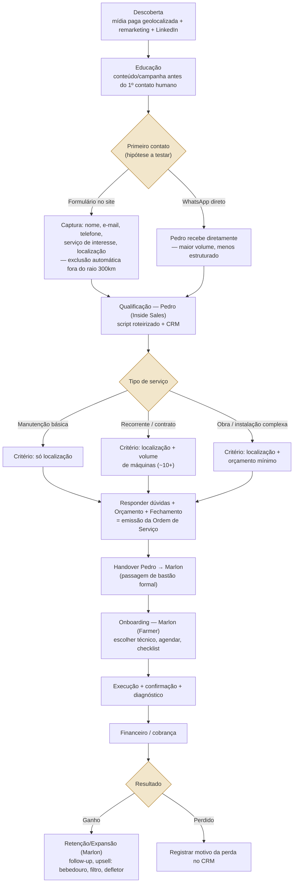

# Drawflow — Mídia Paga & Captura de Clientes — JK Climatização
**Gerado em:** 10/07/2026
**Fonte:** Reconstrução fiel dos planos de ação já apresentados em [S1] Kick-off (28/05), [S3] Diagnóstico de Marketing (19/06) e [S4] Diagnóstico Comercial (01/07) — nenhum passo aqui foi inventado, tudo tem citação de origem.

> Visual navegável (mesmo conteúdo, layout técnico estilo blueprint): [Artifact — Drawflow JK Climatização](https://claude.ai/code/artifact/06eba54b-ae25-40df-aaad-6439f1193ecf)

---

## ⟳ Atualização 10/07/2026 — nova planilha de keywords

A planilha de keywords nova (1.517 linhas, deduplicada) mudou UM ponto neste drawflow: dentro da **Fase 3 — Google Ads**, "instalação de ar condicionado" apareceu como o maior cluster de demanda real de toda a pesquisa (~2.750 buscas/mês) — praticamente ausente na pesquisa anterior. Isso vira uma **terceira verba** dentro da Fase 3 (além de técnica/PMOC e ampla/residencial), com racional próprio: capturar quem já decidiu instalar (potencial wedge de entrada pro B2B se segmentado por geografia/perfil de imóvel). O volume B2B/PMOC específico continua baixíssimo e não muda nenhum outro nó do fluxo.

---

## Nota metodológica

S1 (Kick-off) e S2 (Pesquisa de Mercado) são etapas de diagnóstico/contextualização — não contêm plano de ação operacional. O próprio Lucas avisa isso em S2: *"no próximo a gente vai entregar plano de ação"*. Os planos concretos aparecem em **S3** (mídia paga, apresentado por Daniel Silva Lorêdo) e **S4** (funil comercial, desenhado por Lucas Calefi).

**Gap identificado:** as fontes cobrem bem 0-6 meses (os dois fluxos abaixo) e citam um horizonte de 2-5 anos (IA de agendamento, priorização técnica automática, portal do cliente com PMOC em tempo real) — mas a fase intermediária de 6-18 meses **não foi encontrada** em nenhuma transcrição. Confirmar com Sabrina/Daniel antes de preencher esse intervalo na apresentação.

---

## Fluxo 1 — Estratégia de Mídia Paga

Ordem seguida na reunião S3: **Pré-requisitos → Meta Ads → LinkedIn Ads → Google Ads (Search+Display+GMB) → Orgânico**.

### Detalhamento por fase

**Pré-requisitos**
- Verificação de anunciante Google Ads — prazo 19/07 *(S3)*
- Estruturar página LinkedIn — hoje só existe criada, sem conteúdo *(S3, Daniel)*
- Identidade visual (paleta, tipografia, grid, biblioteca de assets) *(S3, Nícolas)*
- Nova Landing Page + tag de rastreamento — blocos B2B (compliance/PMOC) e B2B2C (arquitetos, "climatização invisível"), CTA direcionado, calculadora de BTU como isca *(S3, Sabrina; benchmark concorrente COD)*

**Fase 1 — Meta Ads:** *"o Metaeds tá muito para remarket"* — remarketing de quem visitou o site + lookalike a partir da lista de clientes atuais. Custo diário de referência: R$6.

**Fase 2 — LinkedIn Ads:** segmentação por cargo (gerente de manutenção, diretor de compras/operações, facilities, arquitetura corporativa, indústria, bancos/cooperativas). Prioridade: InMail patrocinado (*"a gente já tem experiências... esse tipo de estratégia funciona"* — case Marilan). Depois: campanha de imagem/vídeo. R$4/clique mínimo, iniciar com R$50/dia.

**Fase 3 — Google Ads:** *"a principal segmentação do Google, cara, é batata, é palavra-chave"* — verbas paralelas (técnica/PMOC, ampla/residencial, e **nova: "instalação"** — maior cluster de demanda da planilha atualizada, ~2.750 buscas/mês) + lista de negativação colaborativa (processo diário) + GMB geolocalizado em raio de 300km.

**Suporte contínuo:** Instagram orgânico organizado por tema, conteúdo de dor, vídeos que depois viram criativo pago.

---

## Fluxo 2 — Captura & Qualificação de Clientes

Desenhado por Lucas Calefi ao final de S4.

### Detalhamento por etapa

1. **Descoberta** — mídia paga geolocalizada (raio 300km), remarketing Meta, LinkedIn
2. **Educação** — conteúdo/campanha entre a descoberta e o primeiro contato humano
3. **Primeiro contato — hipótese a testar:** *"Isso vai ser hipótese testada. Qual que vai funcionar melhor? Via formulário... só que em questão de volume vai ser muito menor... isso é uma hipótese para ser testado logo no início da execução de mídia paga"* — **formulário** (nome, e-mail, telefone, serviço de interesse: recorrente/obra nova/instalação/avulsa, localização com exclusão automática fora do raio) **ou WhatsApp direto**
4. **Qualificação — Pedro (Inside Sales):** script roteirizado + CRM. Critério varia por tipo de serviço:
   - Manutenção básica → só localização
   - Recorrente/contrato → localização + volume de máquinas (referência: ~10+, "empresa de verdade")
   - Obra/instalação complexa → localização + orçamento mínimo
5. **Orçamento + Fechamento** = emissão da Ordem de Serviço (OS) — *"a tua venda... o comit"*, não é o pagamento em si
6. **Handover Pedro → Marlon** — *"esse processo tem que ter um handover muito claro... apresenta, adiciona no grupo... ó, esse aqui é o Marlon"* — hoje é o ponto mais nebuloso/conflituoso do processo
7. **Onboarding — Marlon (Farmer):** escolher técnico, agendar, checklist da equipe
8. **Execução + confirmação + diagnóstico** → **Financeiro/cobrança**
9. **Ganho** → Retenção/Expansão (Marlon): follow-up, upsell (bebedouro, filtro, defletor) · **Perdido** → registrar motivo no CRM

**Cadência transversal (ainda não implementada):** resposta em até 5 minutos = 60% mais chance de conversão; maioria das vendas exige 6-12 tentativas de follow-up. Hoje: zero follow-up estruturado (nem no cliente oculto da própria JK).

---

## Dependências e ordem de implementação

- LinkedIn: página estruturada **antes** de anúncio pago
- Google Ads: nova LP + tag de rastreamento **antes** de saber origem real de cada lead/palavra-chave
- CRM: pré-requisito repetido para medir CVR, ticket médio e follow-up — hoje é "uma caixa preta" de WhatsApp/planilha
- Playbook comercial: documentar o conhecimento do Marlon é pré-requisito pra escalar o time — *"não dá para depender da pessoa passar esse processo para você"*
- Handover Pedro→Marlon precisa estar formalizado antes do processo fluir sem confusão
- Verificação de anunciante Google Ads: prazo 19/07
- Teste formulário-vs-WhatsApp só é possível depois que a mídia paga estiver rodando

## Responsáveis

| Pessoa | Papel |
|---|---|
| Daniel Silva Lorêdo | Gestor de tráfego pago (Meta, LinkedIn, Google Ads) |
| Nícolas Kobayashi | Designer — identidade visual e criativos |
| Sabrina Souza da Silva | Gestora de projeto/CS — comercial, benchmarks, LP |
| Lucas Calefi Gonçalves | Planejamento e estratégia — funil, CRM, plano comercial |
| Pedro Weege Semeraro | SDR / Inside Sales |
| Marlon Da Costa | Farmer/CS — onboarding, recorrência, prospecção |
| André Ricardo Krueger | Negociações grandes, segunda visita técnica |
