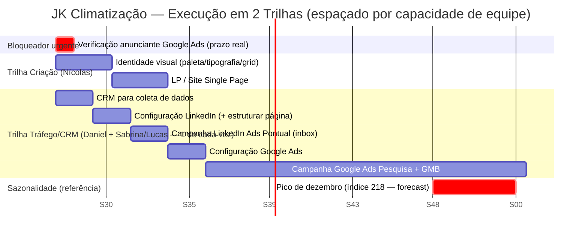

# Plano de Execução — Mídia Paga + CRM — JK Climatização
**Gerado em:** 10/07/2026
**Fonte:** atividades definidas pelo operador + dependências reais já identificadas em `drawflow-midia-e-captura.md` (S3/S4) + sazonalidade real de `forecast-midia-paga-12-meses.md`

> Visual navegável (interativo, com hover e visão em tabela): [Artifact — Gantt JK Climatização](https://claude.ai/code/artifact/690eee2a-df70-45ae-8294-63a005b47f47)

---

## Escopo

Este plano cobre as 7 atividades definidas pelo operador. **Não inclui** a transformação comercial (scripts SDR, scoring 1-5⭐, papéis Pedro/Marlon) já entregue em `ee-s4-diagnostico-comercial`/`ee-s5-scripts-sdr` — se quiser um Gantt único cobrindo os dois fronts, avisa que eu integro.

**Dependência não-listada, sinalizada:** identidade visual (paleta/tipografia/grid — conduzida por Nícolas, já mencionada em S3) é pré-requisito real da LP ficar com o design definitivo. Incluí como uma barra de apoio no Gantt para não ficar escondida, mas não conta como uma das 7 atividades do escopo.

**Por que a janela antes do pico importa:** o forecast já mostrou que dezembro concentra o pico de sazonalidade mais forte do ano (índice 218, quase o dobro da média) — o objetivo deste cronograma é ter tudo no ar e já otimizado ANTES desse pico.

**Atualização (10/07, 2ª rodada):** o plano original tinha 4-5 frentes começando na mesma semana — não realista sem equipe dedicada. Reestruturado em **2 trilhas**, cada uma com no máximo 1 tarefa ativa por vez:
- **Trilha Criação** (Nícolas): Identidade Visual → LP
- **Trilha Tráfego/CRM** (Daniel + Sabrina/Lucas): CRM → Config. LinkedIn → Campanha LinkedIn → Config. Google Ads → Campanhas Google

*(Premissa de equipe assumida — ajustável. Se a divisão real de pessoas for outra, o sequenciamento muda.)*

**Trade-off que isso cria:** espalhar tudo empurra o lançamento das campanhas de Google de agosto para a **Semana 9 (07/09)** — o colchão de otimização antes do pico de dezembro cai de ~4 meses para **~11 semanas**. Ainda é tempo suficiente, mas qualquer atraso numa tarefa da Trilha Tráfego (que é 100% sequencial) come direto desse colchão.

---

## Cronograma (WBS) — em semanas

| # | Atividade | Trilha | Semana | Datas | Depende de |
|---|---|---|---|---|---|
| 0 | 🔴 Verificação de anunciante — Google Ads | — (baixo esforço) | Sem 1 | 13–19/07 | — (bloqueador externo, prazo da própria plataforma) |
| — | Identidade visual — *não listada, flagada* | Criação | Sem 1-3 | 13/07–02/08 | — |
| 2 | CRM para coleta de dados | Tráfego/CRM | Sem 1-2 | 13–26/07 | — |
| 3 | Config. LinkedIn Ads (+ estruturar página) | Tráfego/CRM | Sem 3-4 | 27/07–09/08 | #2 (mesma equipe) |
| 1 | LP / Site Single Page | Criação | Sem 4-6 | 03–23/08 | Identidade visual |
| 4 | Campanha LinkedIn Ads Pontual (inbox) | Tráfego/CRM | Sem 5-6 | 10–23/08 | #3 |
| 5 | Configuração do Google Ads | Tráfego/CRM | Sem 7-8 | 24/08–06/09 | #4 (mesma equipe) + #0 |
| 6+7 | Campanha Google Ads — Pesquisa (LP/Site) + GMB | Tráfego/CRM | Sem 9+ | a partir de 07/09, contínua | #1 (LP) + #5 |

*Campanhas de Google Ads rodam continuamente a partir do lançamento — ~11 semanas de otimização (set-nov) antes do pico de dezembro (Semana ~20).*

---

## Gantt (Mermaid — pronto para colar em qualquer ferramenta)

---

## Caminho crítico

**Trilha Tráfego/CRM inteira** (CRM → Config. LinkedIn → Campanha LinkedIn → Config. Google Ads → Campanhas Google) — é 100% sequencial porque assume a mesma equipe pequena tocando uma coisa de cada vez. Qualquer atraso em qualquer um desses 5 passos empurra o lançamento das campanhas de Google direto, comendo do colchão de 11 semanas antes do pico de dezembro.

A **Trilha Criação** (Identidade Visual → LP) é mais folgada — termina na Semana 6, e a Trilha Tráfego só precisa dela pronta na Semana 9 (3 semanas de gordura).

O ponto de convergência (Semana 9) é onde as duas trilhas precisam se encontrar: LP pronta (Sem 6) **e** Google Ads configurado (Sem 8) — o que chegar depois manda no lançamento.

---

## Marcos

- **19/07 (Sem 1)** — Verificação de anunciante resolvida (ou escalado se não resolver)
- **02/08 (Sem 3)** — Identidade visual pronta
- **23/08 (Sem 6)** — LP pronta + Campanha LinkedIn lançada
- **06/09 (Sem 8)** — Google Ads configurado
- **07/09 (Sem 9)** — Campanhas de Google Ads (Pesquisa + GMB) no ar
- **~fim de novembro (Sem ~20)** — Fim da janela de otimização, ~11 semanas de aprendizado acumulado antes do pico
- **Dezembro** — Pico de sazonalidade (índice 218) — campanhas já devem estar maduras, não em fase de aprendizado
